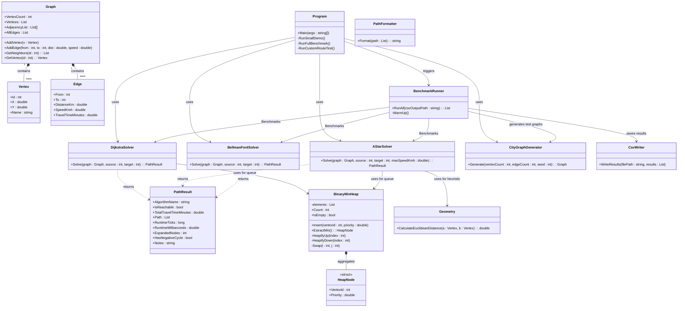

# Architecture Diagram

The diagram below shows the architecture of the **Smart Emergency Route Planner** application.

```mermaid
classDiagram
    class Program {
        +Main(args : string[])
        -RunSmallDemo()
        -RunFullBenchmark()
        -RunCustomRouteTest()
    }

    class Graph {
        +VertexCount : int
        +Vertices : List<Vertex>
        +AdjacencyList : List<Edge>[]
        +AllEdges : List<Edge>
        +AddVertex(v : Vertex)
        +AddEdge(from : int, to : int, dist : double, speed : double)
        +GetNeighbors(id : int) : List<Edge>
        +GetVertex(id : int) : Vertex
    }

    class Vertex {
        +Id : int
        +X : double
        +Y : double
        +Name : string
    }

    class Edge {
        +From : int
        +To : int
        +DistanceKm : double
        +SpeedKmh : double
        +TravelTimeMinutes : double
    }

    class PathResult {
        +AlgorithmName : string
        +IsReachable : bool
        +TotalTravelTimeMinutes : double
        +Path : List<int>
        +RuntimeTicks : long
        +RuntimeMilliseconds : double
        +ExpandedNodes : int
        +HasNegativeCycle : bool
        +Notes : string
    }

    class BinaryMinHeap {
        -elements : List<HeapNode>
        +Count : int
        +IsEmpty : bool
        +Insert(vertexId : int, priority : double)
        +ExtractMin() : HeapNode
        -HeapifyUp(index : int)
        -HeapifyDown(index : int)
        -Swap(i : int, j : int)
    }

    class HeapNode {
        <<struct>>
        +VertexId : int
        +Priority : double
    }

    class DijkstraSolver {
        +Solve(graph : Graph, source : int, target : int) : PathResult
    }

    class AStarSolver {
        +Solve(graph : Graph, source : int, target : int, maxSpeedKmh : double) : PathResult
    }

    class BellmanFordSolver {
        +Solve(graph : Graph, source : int, target : int) : PathResult
    }

    class CityGraphGenerator {
        +Generate(vertexCount : int, edgeCount : int, seed : int) : Graph
    }

    class BenchmarkRunner {
        +RunAll(csvOutputPath : string) : List<BenchmarkResult>
        -WarmUp()
    }

    class CsvWriter {
        +WriteResults(filePath : string, results : List<BenchmarkResult>)
    }

    class Geometry {
        +CalculateEuclideanDistance(a : Vertex, b : Vertex) : double
    }

    class PathFormatter {
        +Format(path : List<int>) : string
    }

    %% Relationships
    Program --> BenchmarkRunner : triggers
    Program --> CityGraphGenerator : uses
    Program --> DijkstraSolver : uses
    Program --> AStarSolver : uses
    Program --> BellmanFordSolver : uses
    
    BenchmarkRunner --> CityGraphGenerator : generates test graphs
    BenchmarkRunner --> DijkstraSolver : Benchmarks
    BenchmarkRunner --> AStarSolver : Benchmarks
    BenchmarkRunner --> BellmanFordSolver : Benchmarks
    BenchmarkRunner --> CsvWriter : saves results
    
    DijkstraSolver --> BinaryMinHeap : uses for queue
    AStarSolver --> BinaryMinHeap : uses for queue
    AStarSolver --> Geometry : uses for heuristic
    
    Graph "1" *-- "many" Vertex : contains
    Graph "1" *-- "many" Edge : contains
    
    DijkstraSolver ..> PathResult : returns
    AStarSolver ..> PathResult : returns
    BellmanFordSolver ..> PathResult : returns
    
    BinaryMinHeap *-- HeapNode : aggregates
```
